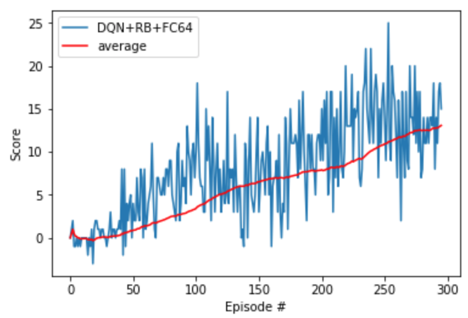
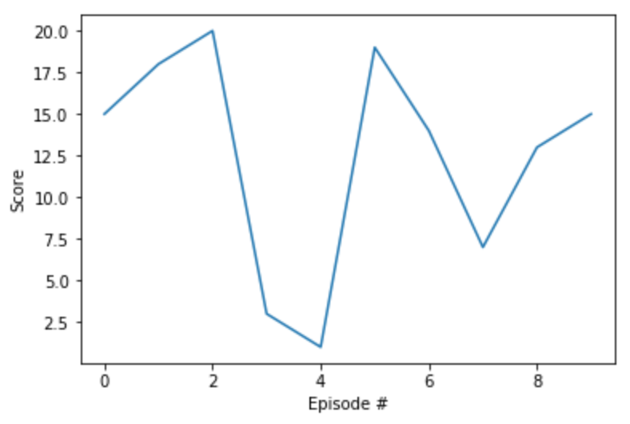

#### Udacity Deep Reinforcement Learning Nanodegree
### Project 1: Navigation
# Train an RL Agent to Collect Bananas
:banana::banana::banana::banana::banana::banana::banana::banana::banana::banana::banana::banana::banana::banana::banana::banana::banana::banana::banana::banana::banana::banana:


*Above: My trained agent in action!*

##### &nbsp;

## Goal
In this project, I build a reinforcement learning (RL) agent that navigates an environment that is similar to [Unity's Banana Collector environment](https://github.com/Unity-Technologies/ml-agents/blob/master/docs/Learning-Environment-Examples.md#banana-collector).

A reward of +1 is provided for collecting a yellow banana, and -1 for collecting a blue banana. The goal is to collect as many yellow bananas as possible while avoiding blue bananas. In order to solve the environment, the agent must achieve an average score of +13 over 100 consecutive episodes.

##### &nbsp;

## Approach
Here are the high-level steps taken in building an agent that solves this environment.

1. Evaluate the state and action space.
1. Establish baseline using a random action policy.
1. Implement learning algorithm.
1. Run experiments to measure agent performance.
1. Select best performing agent and capture video of it navigating the environment.

##### &nbsp;

### 1. Evaluate State & Action Space
The state space has 37 dimensions and contains the agent's velocity, along with ray-based perception of objects around the agent's forward direction. Given this information, the agent has to learn how to best select actions. Four discrete actions are available:

- `0` move forward
- `1` move backward
- `2` turn left
- `3` turn right


##### &nbsp;

### 2. Establish Baseline
Before building an agent that learns, I started by testing an agent that selects actions (uniformly) at random at each time step.

```python
env_info = env.reset(train_mode=False)[brain_name] # reset the environment
state = env_info.vector_observations[0]            # get the current state
score = 0                                          # initialize the score
while True:
    action = np.random.randint(action_size)        # select an action
    env_info = env.step(action)[brain_name]        # send the action to the environment
    next_state = env_info.vector_observations[0]   # get the next state
    reward = env_info.rewards[0]                   # get the reward
    done = env_info.local_done[0]                  # see if episode has finished
    score += reward                                # update the score
    state = next_state                             # roll over the state to next time step
    if done:                                       # exit loop if episode finished
        break

print("Score: {}".format(score))
```

Running this agent a few times resulted in scores from -2 to 2. Obviously, if the agent needs to achieve an average score of 13 over 100 consecutive episodes, then choosing actions at random won't work.


##### &nbsp;

### 3. Implement Learning Algorithm
Agents use a policy to decide actions. The primary objective is to find an optimal policy to maximize the reward via interacting with the environment and recording observations. Thus, the agent "learns" the policy through a process of trial-and-error that iteratively maps various environment states to the actions that yield the maximum reward as called **Q-Learning** which can be approximated by neural networks.

#### Q-Function
The Q-function calculates the expected reward `R` for all possible actions `A` in all possible states `S`.  Let us define the optimal policy `π*` as the action that maximizes the Q-function for a given state across all possible states. The optimal Q-function `Q*(s,a)` maximizes the total expected reward for an agent starting in state `s` and choosing action `a`, then following the optimal policy for each subsequent state.


In order to discount returns at future time steps, the Q-function can be expanded to include the hyperparameter gamma `γ`.


#### Epsilon Greedy Algorithm
One challenge above is to choose which action to take while the agent is still learning the optimal policy. Should the agent choose an action based on the Q-values observed thus far? Or, should the agent try a new action in hopes of earning a higher reward? This is known as the **exploration vs. exploitation dilemma**.  This can be addressed by **𝛆-greedy algorithm**. This algorithm allows the agent to systematically manage the exploration vs. exploitation trade-off. The agent "explores" by picking a random action with some probability epsilon `𝛜`. But, the agent continues to "exploit" its knowledge of the environment by choosing actions based on the policy with probability (1-𝛜).

Furthermore, epsilon is purposely decayed over time, so that the agent favors exploration during its initial interactions with the environment, but increasingly favors exploitation as it gains more experience. The starting and ending values for epsilon, and the rate at which it decays are three hyperparameters that are later tuned during experimentation.


#### Deep Q-Network (DQN)
With Deep Q-Learning, a deep neural network is used to approximate the Q-function. Given a network `F`, finding an optimal policy is a matter of finding the best weights `w` such that `F(s,a,w) ≈ Q(s,a)`.

The neural network  used for this project can be found in the `model.py` file of the source code. The network contains three fully connected layers with 64, 64, and 4 nodes respectively. Nuemrical testing with more nodes and deeper networks (more layers) did not produce better results.

As for the network inputs, rather than feeding-in sequential batches of experience tuples, I randomly sample from a history of experiences using an approach called Experience Replay.


#### Experience Replay
Experience replay allows the RL agent to learn from past experience.

Each experience is stored in a replay buffer as the agent interacts with the environment. The replay buffer contains a collection of experience tuples with the state, action, reward, and next state `(s, a, r, s')`. The agent then samples from this buffer as part of the learning step. Experiences are sampled randomly, so that the data is uncorrelated. This prevents action values from oscillating or diverging catastrophically, since a naive Q-learning algorithm could otherwise become biased by correlations between sequential experience tuples.  Also, experience replay improves learning through repetition. By doing multiple passes over the data, our agent has multiple opportunities to learn from a single experience tuple. This is particularly useful for state-action pairs that occur infrequently within the environment.


##### &nbsp;

### 4. Run Experiments
Now it's time to measure the agent's performance within the Banana environment. Performance is measured by the fewest number of episodes (from 1-300) required to solve the environment.  The first plot below shows the perfomrance from training and the second plot shows the perfomrance from testing





##### &nbsp;


##### &nbsp;

## Future Improvements

- **Add *prioritized* experience replay** &mdash; Rather than selecting experience randomly, prioritized replay selects experiences based on a priority value that is correlated with the magnitude of error. This can improve learning by increasing the probability that rare and important experience vectors are sampled.
- **Replace conventional exploration heuristics with Noisy DQN** &mdash; This approach is explained [here](https://arxiv.org/abs/1706.10295) in this research paper. The key takeaway is that parametric noise is added to the weights to induce stochasticity to the agent's policy, yielding more efficient exploration.

##### &nbsp;
##### &nbsp;
